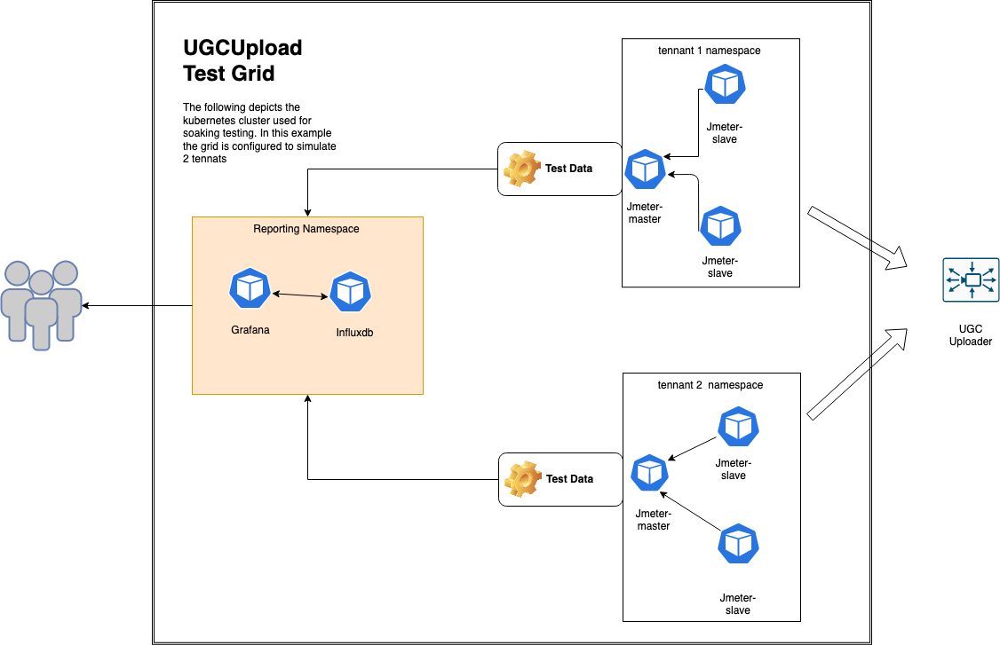
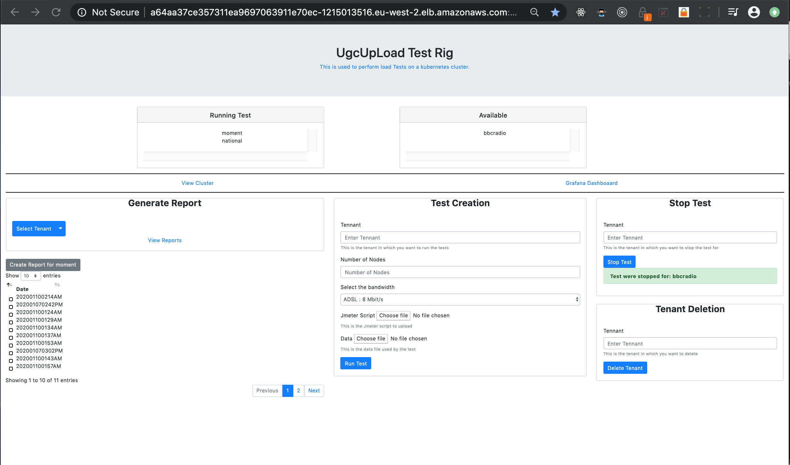
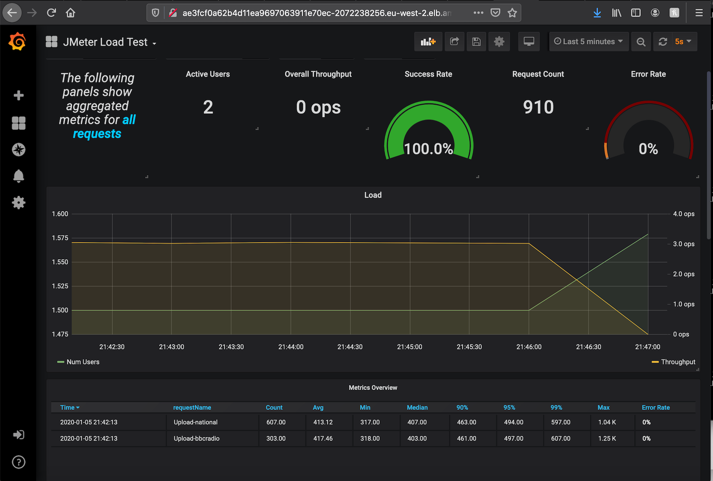
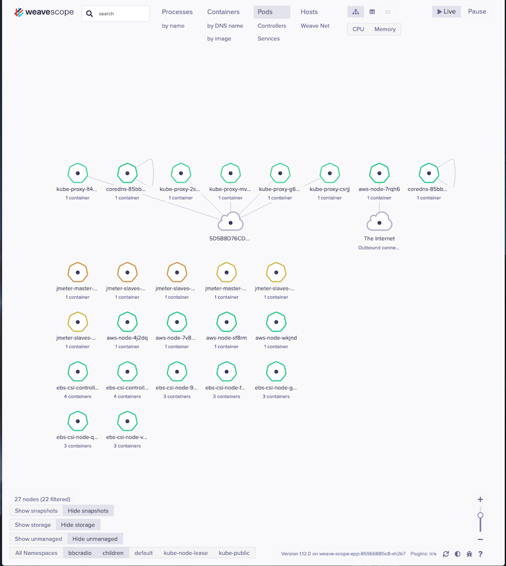

#   Distributed Jmeter Test Rig Using Kubernetes


Table of Contents
=================

  - [Introduction](#introduction)
    + [Jmeter Test Creation Process](#jmeter--test--creation)
    + [Running Tests](#running--tests)
    + [Generate Jmeter Report](#generate--jmeter--report)
    
  - [Dependencies](#dependencies)
    
    + [Prerequisite](#prerequisite)  

  - [Architectural Components](#architectural-components)
    
  - [Create Test Rig Cluster](#create--test--rig--cluster)

  - [Containerize And Upload to ECR(AWS Docker Repo)](#containerize--and--upload--to--ecr)

  - [Provision Test Rig](#provision--test--rig)
    + [Create Reporting Virtual Cluster](#create--reporting--virtual--cluster)
       + [Acccess Grafana Dashboard](#acccess--grafana--dashboard)
       + [Install Jmeter Dashboard](#install--jmeter--dashboard)
    + [Add Tennant To Cluster](#add--tennant--to--cluster)
    
- [Admin Controller](#admin--controller)
  
  + [Install](#install)
  + [Grant Permissions](#grant--permissions)
  + [Accessing Controller using SSH](#accessing--controller--using--ssh)
   + [Initialize Kubernetes environment](#initialize--kubernetes--environment)
  + [Monitor Cluster](#monitor-cluster)
    + [View In Browser](#view--in--browser)
    

# Introduction


The purpose of the Test Rig is to emulate the interaction that occurs when multiple tennants are using the system. In order to achieve this, each tennant will be associated with a namespace. Within this namespace a distributed Jmeter test will be deployed that runs a test specific for that tennant.

Once the test completes the results are uploaded to an s3 bucket *afriex-jmeter-reports* 

The diagram below depicts the scenario when 2 tenants are being simulated.

# 


## Jmeter Test Creation

The following is the process that should be followed to create test and deploy to the cluster.

1. Create test. 
  
   + Test should be stored in the folder `src/test`
   
2. Containerize the test by re-building the *master* jmeter image. Follow the instructions outlined here [Containerize And Upload to ECR(AWS Docker Repo)](#containerize--and--upload--to--ecr)

3. Provision tennant: If tennant is already provisioned undo first: Follow instructions outlined here  [#Add Tennant To Cluster](#add--tennant--to--cluster)

4. jmeter variables:<br> The test are dependant on the following jmeter variables: <br>

   | Variable     | Description                                         | Example      |
   | ------------ | --------------------------------------------------- | ------------ |
   | test.data    | The is the location of the data used by the scripts | /data        |
   | test.results | This is where the reponse from the test are stored. | /test-output |

   


## Running Tests

The screen shot below is the admin gui used to start and manage the tests. This can be accessed after installing the  [Admin Controller](#admin--controller). Used the following command to get the external ip: `kubectl get service -n control`

Use the following url: ```http:<<external-ip>>:1323/```




# Dependencies

1. EKSCTL: https://eksctl.io/introduction/installation/ <br>This is used to create and manipulate the cluster
2. KUBECTL: https://kubernetes.io/docs/tasks/tools/install-kubectl/#install-kubectl-on-macos <br>Used to provision and orchestrate kubernetes.
3. Docker: https://docs.docker.com/install/ <br>Used to push images to the ECR repository.
4. AWS I am authenticator: https://docs.aws.amazon.com/eks/latest/userguide/install-aws-iam-authenticator.html

## Prerequisite

### Tooling

The *eksctl* tool does not work with *~/.aws/credential* file unless you make  modifications to` ./kube/config`

The following modifications were done to fetch-aws-creds:

```

with open(home + '/workspace/github.com/afriexUK/afriex-jmeter-testbencher-test-kubernettes/setup-aws-env.sh', 'w') as f:
    f.write('export AWS_ACCESS_KEY_ID={accessKeyId}\n'.format(**creds))
    f.write('export AWS_SECRET_ACCESS_KEY={secretAccessKey}\n'.format(**creds))
    f.write('export AWS_SESSION_TOKEN={sessionToken}\n'.format(**creds))
    f.write('export PATH=$PATH:~/Library/Python/3.7/bin\n')

st = os.stat(home + '/workspace/setup-aws-env.sh')
os.chmod(home + '/workspace/setup-aws-env.sh', st.st_mode | stat.S_IEXEC)
```

Following command can then be issued to set the AWS environmental variables.

**source  ~/workspace/setup-aws-env.s**

# Architectural Components

The diagram below is an illustration of the architecural components that exist within the system.

**FileUpload**

This an agent that is installed on each slave.  This is used to transfer files to the slave and also start jmeter slave on the container.

**Master**

This component is installed on the master and is used to start and stop the tests.

**Admin Controller**

This is the front end interface used by the user for test creation.


# Create Test Rig Cluster

The document in this link [CreateCluster](CreateClusterSteps.md) outlines the steps for creating the cluster.


# Containerize And Upload to ECR

Before you can deploy to the ECR repository you will need to login.

The following command can be used to get the docker login command:

**aws ecr get-login --no-include-email --region eu-west-3 | sed 's|https://||'**

In the folder **docker** There are three sub folders **base**, **control**, **master** and **slave**

In each of these sub folders run the command:  `deploy.sh`

Eg.`deploy.sh`

### Building JMETER base Image:

This is located in `docker/base`.

If your test utilises any plugins the corresponding jar(s) should be put in the folder *plugins*


# Provision Test Rig

If you want to provision multiple environments for a single tennat and want the results consolidated together then use the following naming convention: `tennant-<type>` as an example for `bbcradio` you want to create two enviroments for running two different jemeter tests. i.e one for adsl users and another for mobile gprs users. Eg. `bbcradio-adls` and ` bbcradio-mobile-gprs`.

 

## Create Reporting Virtual Cluster

In the folder *kubernetes-artefacts/reporter* 

There are two scripts:

1. *create-report-env.sh* Used to create the reporting virtual environmnt in the cluster. <br> Usage:  `create-report-env.sh`  eg. *./create-report-env.sh* <br>Used the following to command to verify that the instances have succesfully started before moving to the next step. `kubectl get pods --all-namespaces`
2. *configure-reporting.sh* Used to setup grafana and influxes. <br> Usage: `./configure-reporting.sh` <br> If you see the following error. It is safe to ignore<br>```wget: can't open 'datasources': Permission denied
   command terminated with exit code 1```
3. *un-do.sh* Used to remove the reporting virtual environment from the cluster.<br>

The table below details the steps performed by the script to create the virtual environment.

| Step | Objective                                  | Description                                                  | Action                                                       |
| ---- | ------------------------------------------ | ------------------------------------------------------------ | ------------------------------------------------------------ |
| 1    | create reporting namespace                 | This is the namespace use                                    | *kubectl create namespace ugcload-reporter*                  |
| 2    | Add ServiceAccount to the virtual cluster. | Is to give pods in the virtual cluster access to aws resources. The policy Arn is the one created when setting up the cluster. | *eksctl create iamserviceaccount --name github.com/afriexUK/afriex-jmeter-testbench-jmeter --namespace ugcload-reporter   --cluster ugcloadtest --attach-policy-arn arn:aws:iam::625194385885:policy/github.com/afriexUK/afriex-jmeter-testbench-eks-jmeter-policy --approve --override-existing-serviceaccounts* |
| 3    | Install lnfluxdb                           | This is used to collect time series data from the test       | *kubectl create -n ugcload-reporter -f influxdb.yaml*        |
| 4    | Install Grafana                            | This the dashboard used to get insight about running tests.  | *Kubectl create -n ugcload-jmeter -f grafana.yaml*           |


### Acccess Grafana Dashboard

The instance has been configured to map to the load balancer.

The following command can be used to get the url:`kubectl get services --namespace=ugcload-reporter`

This will return the following:

| NAME           | TYPE         | CLUSTER-IP    | EXTERNAL-IP                                                  | PORT(S)        | AGE  |
| -------------- | ------------ | ------------- | ------------------------------------------------------------ | -------------- | ---- |
| jmeter-grafana | LoadBalancer | 10.100.244.16 | a708e1018287211ea905d060265a2432-970821218.eu-west-3.elb.amazonaws.com | 3000:30158/TCP | 27m  |

From the example above the following URL can be used to access the dashboard.

http://a708e1018287211ea905d060265a2432-970821218.eu-west-3.elb.amazonaws.com:3000

### Install Jmeter Dashboard

Below is the dashboard used to visualise the results.

https://grafana.com/grafana/dashboards/1152 





## Add Tennant To Cluster

In the folder *kubernetes-artefacts/tennant* There file *add-tennat-to-cluster.sh* can be used to add a tenant's test environment to the cluster. Usage: `add-tennat-to-cluster.sh <namespace>`

eg. *./add-tennat-to-cluster.sh bbcradio*

The file `un-do.sh` can be used to remove the tennant from the cluster.

Eg. *./un-do.sh bbcradio*


# Admin Controller

This is used to perform all test operations.

## Install

In the folder `kubernetes-artefacts/controller` use the script `add-control-to-cluster.sh`.

e.g *./add-control-cluster.sh*

## Grant Permissions

The following steps gives the controller the permission to be able to manage the cluster.

1. Configure SSH access using password:<br>You will need to log onto the container to configure it: use the following command<br>`kubectl exec -ti -n control admin-controller -- /bin/bash`

   + Set the passwd for the control user

     `sudo passwd control`

2. Get arn for serviceaccount<br> Use the following comand to get the arn of the service account: <br>*kubectl get afriex-control -n control -o yaml*

3. Add the serviceaccount as a user in the configmap/aws-auth<br>Use the following command to edit `configmap/aws-auth`:*kubectl edit -n kube-system configmap/aws-auth*

   + Add aws account: eg: <br>

     ```
     mapAccounts: |
          "625194385885"
     ```

     

   + Add ServiceAccount role as a user: eg <br>

     ```
      mapUsers: |
         - groups:
           - system:masters
           userarn: arn:aws:iam::625194385885:role/eksctl-jmeterstresstest-addon-iamserviceacco-Role1-1UP7I1N8GUG0W
           username: afriex-control
           
     ```

or  soon you can do this instead: https://github.com/weaveworks/eksctl/issues/625

```
eksctl get aws-auth
eksctl update aws-auth add-role arn:aws:iam::625194385885:role/eksctl-ugcloadtest-addon-iamserviceaccount-c-Role1-1LCQ6ML5AZSTM --username github.com/afriexUK/afriex-jmeter-testbench-control --groups system:masters
eksctl update aws-auth remove-role <arn>
eksctl update aws-auth add-account 625194385885
eksctl update aws-auth remove-account
```

## Accessing Controller using SSH

Use the command below to get the public facing ip:

`kubectl get svc admin-controller -n control`

Then use the command below to login using the password you created for the control user.

`ssh -o TCPKeepAlive=yes -o ServerAliveInterval=30 -o PreferredAuthentications=password -o PubkeyAuthentication=no control@<ADMIN-CONTROLLER-EXTERNAL-IP>`

### Initialize Kubernetes environment

To perform any operations on the environment you will need to run the following commands:

+ gen-env.py

+ source env.sh

+ aws eks --region eu-west-3 update-kubeconfig --name ugcloadtest


# Monitor Cluster

https://www.weave.works/docs/scope/latest/installing/#k8s This is used to monitor the state of the cluster.

To install run the script **install-weavescope.sh** which can be found in **kubernetes-util** folder


## View In Browser

After installing the [Admin Controller](#admin-controller) it can be accessed using the following url:

`http://<EXTERNAL-IP-OF-ADMIN-CONTROLLER>:4040`


Below is the output:

