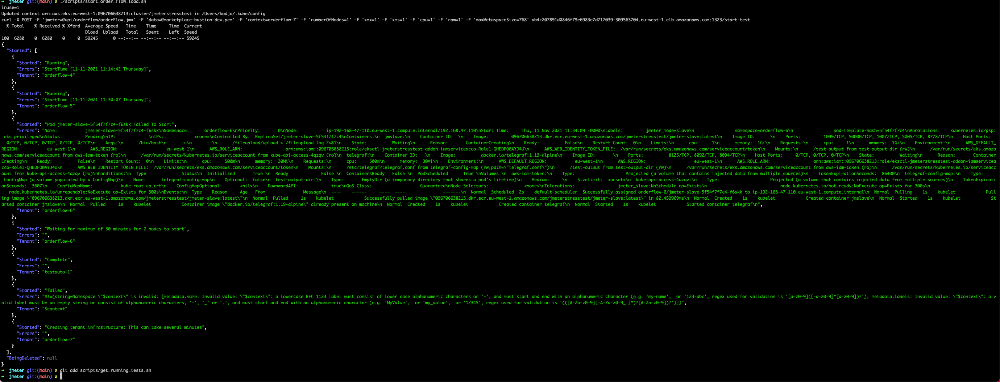

# Maketplace Admin and Api Tests

- [Maketplace Admin and Api Tests](#maketplace-admin-and-api-tests)
    - [Jmeter Test Bench UI](#jmeter-test-bench-ui)
        - [Proxy Setup](#proxy-setup)
        - [Utility Scripts](#utility-scripts)
        - [Known Issues](#known-issues)
          - [Cluster Autoscaling](#cluster-autoscaling)
          - [Out of Memory Exceptions](#out-of-memory-exceptions)
    - [Market Api](#market-api)
      - [Order flow](#order-flow)
        - [Database](#database)
        - [Setup](#setup)
      - [Product Search](#product-search)
    - [Market Place Admin UI](#market-place-admin-ui)
        - [Product Import Export Tests](#product-import-export-tests)
    - [Extending Tests](#extending-tests)


### Jmeter Test Bench UI

To launch a load test go to the following [TestBench ui](http://ab4c207891d0846f79e6983e7d717039-309563704.eu-west-3.elb.amazonaws.com:1323/)

##### Proxy Setup

Some of the jmeter test scripts requires access to the database. This is being done via bastion host. To generate the private key: run the following command:
[fetch_bastion_pem.sh](./scripts/fetch_bastion_pem.sh)

Usage: `./scripts/fetch_bastion_pem.sh <env>`

where `env` can have the followoing values` ['dev','stage','prod']`

This will generate a file called `marketplace-bastion-dev.pem` this should be 
uploaded when running the test. Refer to the screenshot below:


##### Utility Scripts

After setting up the jmeter test scripts the following scripts can be used run the load tests:

The test names are automatically generated. For example the following naming structure is used for the orderflow test:  `orderflow-<count>` where count refers to the number of tests that have been run:</br>

These should be run from the jmeter folder


| Test                                                         | Description                                          | Usage                                                        | Gotcha                                                       |
| ------------------------------------------------------------ | ---------------------------------------------------- | ------------------------------------------------------------ | ------------------------------------------------------------ |
| [start_feature_toggle_laod.sh](./scripts/start_feature_toggle_load.sh) | Used to Run the feaure toggle load test              | `./scripts/start_feature_toggle_load.sh <env> ` </br> where `env` can have the following value [`dev`,`stage`,`prod`] |                                                              |
| [start_order_flow_laod.sh](./scripts/start_order_flow_load.sh) | Used to Run `orderFlow Test`                         | `./scripts/start_order_flow_laod.sh <env>` </br>where `env` can have the following values` ['dev','stage','prod']` | In the example below the test is called: `orderflow-6` </br> |
| [start_import_export_load.sh](./scripts/start_import_export_load.sh) | Used to run `product import test`                    | `./scripts/start_import_export_load.sh <env>` </br>where `env` can have the following values` ['dev','stage','prod']` | In the example below the test is called: `importexport-8` |
| [start_product_search_load.sh](./scripts/start_product_search_load.sh) | Used to search for products                          | `./scripts/start_product_search_load.sh <env>` </br>where `env` can have the following values` ['dev','stage','prod']` | In the example below the test is called: `productsearch-9` |
| [delete_all_tests.sh](./scripts/delete_all_tests.sh)         | Delete all computing resources created for the tests | `./scripts/delete_all_tests.sh`                              |                                                              |
| [get_running_tests.sh](./scripts/get_running_tests.sh)       | Get a list of running and completed tests:           | `./scripts/get_running_test.sh `                             | The attribute `Tennant` holds the name of the running tests. </br>  below is an example output |
|                                                              |                                                      |                                                              |                                                              |
|                                                              |                                                      |                                                              |                                                              |


##### Known Issues

###### Cluster Autoscaling

The amount of computing resources is limited, therefore if you receive the following error, then delete all the tenants i.e free up resources:

```
Name:           jmeter-slave-fb797559b-gpnzm
Namespace:      orderflow-8
Priority:       0
Node:           <none>
Labels:         jmeter_mode=slave
                namespace=orderflow-8
                pod-template-hash=fb797559b
Annotations:    kubernetes.io/psp: eks.privileged
Status:         Pending
IP:             
IPs:            <none>
Controlled By:  ReplicaSet/jmeter-slave-fb797559b
Containers:
  jmslave:
    Image:       625194385885.dkr.ecr.eu-west-3.amazonaws.com/jmeterstresstest/jmeter-slave:latest
    Ports:       1099/TCP, 50000/TCP, 1007/TCP, 5005/TCP, 8778/TCP
    Host Ports:  0/TCP, 0/TCP, 0/TCP, 0/TCP, 0/TCP
    Args:
      /bin/bash
      -c
      --
      /fileupload/upload > /fileupload.log 2>&1
    Limits:
      cpu:     1
      memory:  1Gi
    Requests:
      cpu:     1
      memory:  1Gi
    Environment:
      AWS_DEFAULT_REGION:           eu-west-3
      AWS_REGION:                   eu-west-3
      AWS_ROLE_ARN:                 arn:aws:iam::625194385885:role/eksctl-jmeterstresstest-addon-iamserviceacco-Role1-WW4LQ4N18MBP
      AWS_WEB_IDENTITY_TOKEN_FILE:  /var/run/secrets/eks.amazonaws.com/serviceaccount/token
    Mounts:
      /test-output from test-output-dir (rw)
      /var/run/secrets/eks.amazonaws.com/serviceaccount from aws-iam-token (ro)
      /var/run/secrets/kubernetes.io/serviceaccount from kube-api-access-zlfcx (ro)
  telegraf:
    Image:       docker.io/telegraf:1.19-alpine
    Ports:       8125/TCP, 8092/TCP, 8094/TCP
    Host Ports:  0/TCP, 0/TCP, 0/TCP
    Limits:
      cpu:     500m
      memory:  30Mi
    Requests:
      cpu:     500m
      memory:  30Mi
    Environment:
      AWS_DEFAULT_REGION:           eu-west-3
      AWS_REGION:                   eu-west-3
      AWS_ROLE_ARN:                 arn:aws:iam::625194385885:role/eksctl-jmeterstresstest-addon-iamserviceacco-Role1-WW4LQ4N18MBP
      AWS_WEB_IDENTITY_TOKEN_FILE:  /var/run/secrets/eks.amazonaws.com/serviceaccount/token
    Mounts:
      /etc/telegraf/telegraf.conf from telegraf-config-map (rw,path="telegraf.conf")
      /test-output from test-output-dir (rw)
      /var/run/secrets/eks.amazonaws.com/serviceaccount from aws-iam-token (ro)
      /var/run/secrets/kubernetes.io/serviceaccount from kube-api-access-zlfcx (ro)
Conditions:
  Type           Status
  PodScheduled   False 
Volumes:
  aws-iam-token:
    Type:                    Projected (a volume that contains injected data from multiple sources)
    TokenExpirationSeconds:  86400
  telegraf-config-map:
    Type:      ConfigMap (a volume populated by a ConfigMap)
    Name:      telegraf-config-map
    Optional:  false
  test-output-dir:
    Type:       EmptyDir (a temporary directory that shares a pod's lifetime)
    Medium:     
    SizeLimit:  <unset>
  kube-api-access-zlfcx:
    Type:                    Projected (a volume that contains injected data from multiple sources)
    TokenExpirationSeconds:  3607
    ConfigMapName:           kube-root-ca.crt
    ConfigMapOptional:       <nil>
    DownwardAPI:             true
QoS Class:                   Guaranteed
Node-Selectors:              <none>
Tolerations:                 jmeter_slave:NoSchedule op=Exists
                             node.kubernetes.io/not-ready:NoExecute op=Exists for 300s
                             node.kubernetes.io/unreachable:NoExecute op=Exists for 300s
Events:
  Type     Reason             Age                  From                Message
  ----     ------             ----                 ----                -------
  Normal   NotTriggerScaleUp  4m14s                cluster-autoscaler  pod didn't trigger scale-up:
  Warning  FailedScheduling   17s (x6 over 4m18s)  default-scheduler   0/6 nodes are available: 1 Insufficient cpu, 5 node(s) didn't match Pod's node affinity/selector.

```

###### Out of Memory Exceptions

If you find test failing because of out of memory exceptions then you will need to increase the slave configurations when create a test:


### Market Api

#### Order flow

[Order flow Jmeter Script](./api/orderflow/orderFlow.jmx)
This test creates the order flow. i.e Create order, make payment and complete order.

##### Database
When the tests are run it initializes the database. The Samplers' used in the `Setup Thread Group` and also `TearDown Thread Group` need to have the following properties set:


| Property | Description|
| -------- | ----------- |
|jumperserverHost| This is the ip of the host of the bastion used to connect to database|
|databaseHost| This is the ip of the database to connect to|
|databasePassword| This is the database password|

The following script will fetch the values from aws and update the scripts.

[update_props.sh](./scripts/update_props.sh)

##### Setup

Below is a list with descriptions of all the `User Parameters used` by the test.

| Item         | Description                                                  | Example Value              |
| ------------ | ------------------------------------------------------------ | -------------------------- |
| protocol     | This is http protocol associated with the marketplace endpoint| https                     |
| baseUrl      | This is the url of marketplace                               | sylius-staging.afriex.co.uk |
| apiVersion   |                                                              | api/v2                     | 
| email        | login email of the test user                                 | randomly generated + @gmail.com|
| password     | password of the test user                                    | randomly generated        |
| store        | The store to use for the the test                            | kaunas_2                   |
| productCode  | The sku of the product used for the tests                    | 000000481                  |
| productQuantity|                                                            | 1                          |
| limitValue   | The maximum number of search results allowed                 | 1000000                    |
| name         |                                                              | com.afriex.customer.dev     |
| platform     |                                                              | iOS                        |
| version      |                                                              | 953                        |
| firstName    |                                                              |  Firstname+timestamp       |
| lastName     |                                                              |  Lastname+timestamp        |
| provider     |                                                              |  social                    |
| phoneNumber  |                                                              |  +370 + randomly generated of 8 symbols length|

Note: in "User Parameters" area mentioned values (e.g. randomly generated) could be updated according to your needs.


#### Product Search

[Product Search Jmeter Script](./api/search/productSearch.jmx)
This test searches for one product

### Market Place Admin UI

##### Product Import Export Tests

[Product Import Jmeter Script](./admin/product/importexport/import.jmx)

This test reads a csv file named `create.csv` which should contain the details of the 
products to create. The file should be stored under the directory `test.data` which is specified
in the `user.properties` please look below.

The test require the following variable to defined in `user.properties` 

| Directory    | Description                                                  | Example                                                      |
| ------------ | ------------------------------------------------------------ | ------------------------------------------------------------ |
| test.data    | This is the location where the csv files used by the test needs to be placed | *test.data=/Users/kodjo/workspace/afriex/afriex-marketplace/genImportData* |
| test.results | The directory where the results from the tests should be stored | *test.results=/Users/kodjo/workspace/afriex/afriex-marketplace/genImportData* |
|              |                                                              |                                                              |


### Extending Tests

Recommendations for using additional Thread Groups according to your needs via JMeter (Test Plan -> Add -> Thread (Users)), e.g.:

- "jp@gc - Stepping Thread Group",
- "jp@gc - Ultimate Thread Group",
- "bzm - Concurrency Thread Group" or other.

Note: these mentioned Thread Groups could be found when "Custom Thread Groups" plugin is installed via Jmeter Plugins Manager.

This 
